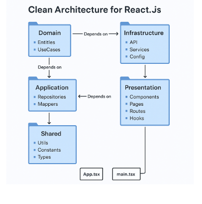

# Getting Started with Create React App

This project was bootstrapped with [Create React App](https://github.com/facebook/create-react-app).

## Available Scripts

In the project directory, you can run:

### `npm start`

Runs the app in the development mode.\
Open [http://localhost:3000](http://localhost:3000) to view it in your browser.

The page will reload when you make changes.\
You may also see any lint errors in the console.

### `npm test`

Launches the test runner in the interactive watch mode.\
See the section about [running tests](https://facebook.github.io/create-react-app/docs/running-tests) for more information.

### `npm run build`

Builds the app for production to the `build` folder.\
It correctly bundles React in production mode and optimizes the build for the best performance.

The build is minified and the filenames include the hashes.\
Your app is ready to be deployed!

See the section about [deployment](https://facebook.github.io/create-react-app/docs/deployment) for more information.

### `npm run eject`

**Note: this is a one-way operation. Once you `eject`, you can't go back!**

If you aren't satisfied with the build tool and configuration choices, you can `eject` at any time. This command will remove the single build dependency from your project.

Instead, it will copy all the configuration files and the transitive dependencies (webpack, Babel, ESLint, etc) right into your project so you have full control over them. All of the commands except `eject` will still work, but they will point to the copied scripts so you can tweak them. At this point you're on your own.

You don't have to ever use `eject`. The curated feature set is suitable for small and middle deployments, and you shouldn't feel obligated to use this feature. However we understand that this tool wouldn't be useful if you couldn't customize it when you are ready for it.

## Learn More

You can learn more in the [Create React App documentation](https://facebook.github.io/create-react-app/docs/getting-started).

To learn React, check out the [React documentation](https://reactjs.org/).

### Code Splitting

This section has moved here: [https://facebook.github.io/create-react-app/docs/code-splitting](https://facebook.github.io/create-react-app/docs/code-splitting)

### Analyzing the Bundle Size

This section has moved here: [https://facebook.github.io/create-react-app/docs/analyzing-the-bundle-size](https://facebook.github.io/create-react-app/docs/analyzing-the-bundle-size)

### Making a Progressive Web App

This section has moved here: [https://facebook.github.io/create-react-app/docs/making-a-progressive-web-app](https://facebook.github.io/create-react-app/docs/making-a-progressive-web-app)

### Advanced Configuration

This section has moved here: [https://facebook.github.io/create-react-app/docs/advanced-configuration](https://facebook.github.io/create-react-app/docs/advanced-configuration)

### Deployment

This section has moved here: [https://facebook.github.io/create-react-app/docs/deployment](https://facebook.github.io/create-react-app/docs/deployment)

### `npm run build` fails to minify

This section has moved here: [https://facebook.github.io/create-react-app/docs/troubleshooting#npm-run-build-fails-to-minify](https://facebook.github.io/create-react-app/docs/troubleshooting#npm-run-build-fails-to-minify)

// Structure proposée (Clean Architecture React.js par Yves Armand)
src/
│
├── domain/                # Règles métier (Entities, UseCases)
│   ├── entities/          # Modèles de données métier
│   └── usecases/          # Logique métier (ex: login, register)
│
├── infrastructure/        # Implémentations concrètes (API, storage)
│   ├── api/               # Appels HTTP
│   ├── services/          # Implémentations des cas d’usage
│   └── config/            # Configuration (Axios, environnement)
│
├── application/           # Interface entre domain et infrastructure
│   ├── repositories/      # Interfaces des services utilisés
│   └── mappers/           # Mappers pour convertir les données
│
├── presentation/          # Composants, pages, routes (UI)
│   ├── components/        # UI components (Button, Input, etc.)
│   ├── pages/             # Pages (Home, Login, Dashboard)
│   ├── routes/            # Définition des routes
│   └── hooks/             # Hooks personnalisés
│
├── shared/                # Code commun (utils, constantes)
│   ├── utils/
│   ├── constants/
│   └── types/
│
├── App.tsx                # Entrée principale
└── main.tsx               # Bootstrap de l'application

src/
├── components/
│   └── MyComponent.tsx
├── pages/
│   └── HomePage.tsx
├── services/
│   └── api.ts
├── types/
│   └── User.ts
├── App.tsx
├── main.tsx
└── vite-env.d.ts

///Flux de données typique
UI (presentation) → UseCase (domain/usecases) → Repository Interface (application) 
→ Implémentation API (infrastructure) → Données

✅ Exemple rapide : Authentification

    1. domain/usecases/LoginUser.ts
        export interface LoginUserUseCase {
        execute(email: string, password: string): Promise<User>;
        }
    2. application/repositories/UserRepository.ts
        export interface UserRepository {
        login(email: string, password: string): Promise<User>;
        }

    3. infrastructure/services/UserService.ts
            import { UserRepository } from "@/application/repositories/UserRepository";

        export class UserService implements UserRepository {
        async login(email: string, password: string): Promise<User> {
            const response = await axios.post("/login", { email, password });
            return response.data;
        }
        }
    4. presentation/pages/LoginPage.tsx

    const LoginPage = () => {
  const handleLogin = async () => {
    const userService = new UserService();
    const user = await userService.login(email, password);
    // Redirect or show user data
  };

  return <button onClick={handleLogin}>Login</button>;
};

🛠️ Technologies recommandées
    React + TypeScript
    Axios pour les appels API
    React Router pour les routes
    Zod / Yup pour la validation
    Context API / Zustand / Redux pour la gestion d’état
    Jest / Testing Library pour les tests

https://github.com/guhur/cours-react/blob/master/README.md

//docker-compose.yml
version: '3.8'

services:
  # 🚀 Backend (Node.js + Express + Sequelize)
  backend:
    build: ./backend
    container_name: backend
    restart: always
    environment:
      - DB_HOST=postgres
      - DB_USER=postgres
      - DB_PASS=postgres
      - DB_NAME=magiktools
      - DB_PORT=5432
      - PORT=3000
    networks:
      - proxy
      - internal
    expose:
      - "3000"
    depends_on:
      - pos tgres

  # 🎨 Frontend (React + Nginx)
  frontend:
    build: ./frontend
    container_name: frontend
    restart: always
    networks:
      - proxy
    expose:
      - "80"

  # 🛢️ Base de données PostgreSQL
  postgres:
    image: postgres:15
    container_name: postgres
    restart: always
    environment:
      POSTGRES_USER: postgres
      POSTGRES_PASSWORD: postgres
      POSTGRES_DB: magiktools
    volumes:
      - ./db-data:/var/lib/postgresql/data
    networks:
      - internal

  # 📊 pgAdmin (UI PostgreSQL)
  pgadmin:
    image: dpage/pgadmin4
    container_name: pgadmin
    restart: always
    environment:
      PGADMIN_DEFAULT_EMAIL: admin@planetkoncept.pro
      PGADMIN_DEFAULT_PASSWORD: admin123
    ports:
      - "5050:80"
    networks:
      - internal

  # 🌐 Reverse Proxy (Nginx Proxy Manager)
  nginx-proxy:
    image: jc21/nginx-proxy-manager:latest
    container_name: npm
    restart: always
    ports:
      - "80:80"
      - "81:81"   # UI admin Proxy Manager
      - "443:443"
    volumes:
      - ./data:/data
      - ./letsencrypt:/etc/letsencrypt
    networks:
      - proxy

# 🔗 Réseaux Docker
networks:
  proxy:
    driver: bridge
  internal:
    driver: bridge
